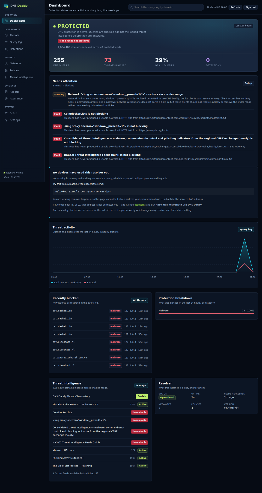
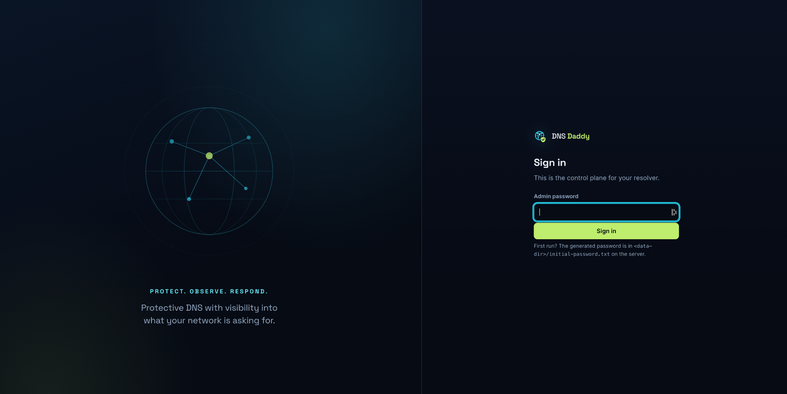
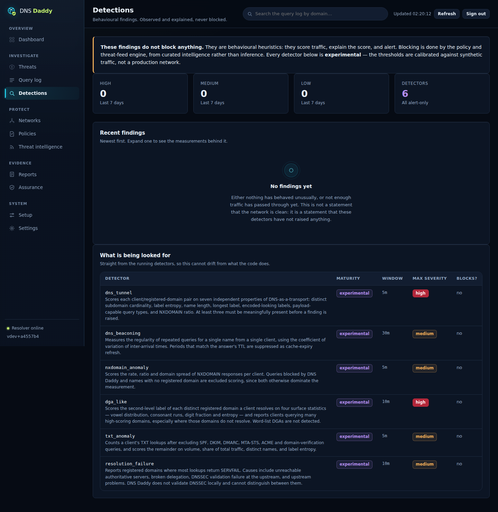
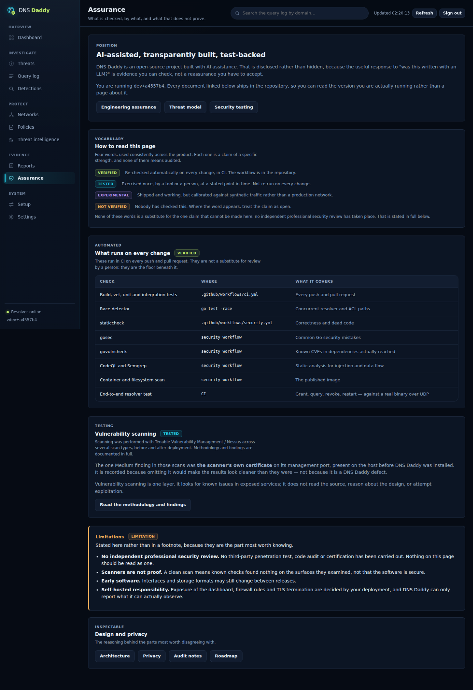

<div align="center">


# DNS Daddy

**A lightweight, self-hosted protective DNS resolver and DNS-security visibility tool.**

Block malicious domains at the resolver. See which device asked for what, why it was stopped, and what your network is asking for — while keeping the telemetry on your own hardware.

**Free & Open Source · No Account · No Trial · No Subscription**

[](https://go.dev)
[](LICENSE)
[](https://github.com/jameshoulder/dnsdaddy/actions/workflows/ci.yml)
[](https://github.com/jameshoulder/dnsdaddy/actions/workflows/security.yml)

</div>

---

> ### Alpha
>
> DNS Daddy works and is actively developed, but it is early software and
> **has not had an independent professional security review**. Run it in
> environments you control. [What is checked, and what none of it
> proves](docs/assurance.md).

## See DNS Daddy in action

<p align="center">
  
</p>

The dashboard keeps the important questions in one place: **is the resolver healthy, what is being blocked, what needs attention, and what has the network been asking for?**

### Protective DNS with a usable control plane

<p align="center">
  
</p>

DNS Daddy is designed to be self-hosted without feeling like a collection of configuration files. The web control plane provides a straightforward way to configure, observe and investigate the resolver.

### Explainable behavioural detections

<p align="center">
  
</p>

DNS Daddy includes six experimental behavioural detectors for DNS tunnelling, beaconing, NXDOMAIN anomalies, DGA-like domains, unusual TXT activity and repeated resolution failures. **They alert and explain; they do not block.**

### Assurance you can inspect

<p align="center">
  
</p>

The **Assurance** page deliberately separates what is *verified*, *tested*, *experimental* and *not verified*. DNS Daddy is AI-assisted and early-stage; rather than hiding that, the project links claims to CI, security testing, threat modelling and documented limitations.

## What is DNS Daddy?

DNS Daddy is a single Go binary that answers DNS for a network. It blocks known-malicious domains using public threat-intelligence feeds, records what happened in plain English, applies different policies to different networks, and raises explainable findings about traffic no feed has heard of yet.

It ships with its own dashboard, a documented REST API, Prometheus metrics, SIEM-friendly exports and a diagnostic command that tells you why DNS is not working when it is not working.

It is aimed at the space commercial protective-DNS platforms occupy — Cisco Umbrella, Cisco Secure Access, DNSFilter and the like — but from the other direction: **lightweight, self-hosted and inspectable**. It makes no claim to their capability, assurance, scale or support.

## Why would I use it?

Public resolvers like Quad9 and Cloudflare can block known-bad domains. What they cannot give you locally is:

- **which device** made the request,
- **why** DNS Daddy blocked it and which feed said so,
- whether one endpoint has been quietly **beaconing** to the same infrastructure,
- or an inspectable **record** of what happened on your own network.

| | |
|---|---|
| **See what a network actually resolves** | A homelab or small office where nobody has ever looked at DNS traffic before. |
| **Investigate a device** | “This laptop was flagged — what has it been asking for?” |
| **Learn protective DNS** | The code, threat model and detector maths are readable, and there is an offline lab. |
| **Keep telemetry in-house** | No account, no cloud tenant and no requirement to upload query logs. |
| **Feed a SIEM** | Findings and query data as documented, versioned NDJSON. |

## What you get

| | |
|---|---|
| **Threat blocking** | Malware, phishing, C2 and cryptomining on by default. Additional categories are available. |
| **Plain-English logs** | Every query records what happened and why. |
| **Per-network policies** | Match clients by CIDR, including different sites and VLANs. |
| **Instant allow-listing** | Clear a false positive from the dashboard and purge the cached answer. |
| **Encrypted upstream** | DNS-over-TLS forwarding by default. |
| **DoH and DoT** | Serves DNS-over-HTTPS and DNS-over-TLS as well as plain DNS. |
| **Behavioural detection** | Six experimental, alert-only detectors with explainable measurements. |
| **Self-diagnosis** | `dnsdaddy doctor` explains configuration, listener, ACL, upstream and threat-intelligence problems. |
| **DNSSEC visibility** | Records the upstream validation verdict per query; DNS Daddy does not locally validate DNSSEC. |
| **SIEM-ready** | Versioned NDJSON with integration guidance for Wazuh, Elastic, Splunk and Sentinel. |
| **Open by construction** | OpenAPI, Prometheus metrics, public threat-feed catalogue and documented design decisions. |

## DNS Daddy + Pi-hole

**DNS Daddy is not a Pi-hole replacement.** Pi-hole is excellent at blocking ads and trackers. DNS Daddy focuses on protective DNS, threat intelligence, explainable security decisions and visibility into what devices are resolving.

The two can run together. If DNS Daddy sits in front with Pi-hole as its upstream, DNS Daddy can retain per-client identity while Pi-hole continues handling ad/tracker blocking.

See **[docs/pi-hole.md](docs/pi-hole.md)** for the topology options, trade-offs and current evidence level.

## Quick start

### Prerequisites

The Docker quick start expects:

- Git
- Docker Engine
- Docker Compose v2 (`docker compose`)

Check them first:

```bash
git --version
docker --version
docker compose version
```

Then:

```bash
git clone https://github.com/jameshoulder/dnsdaddy.git
cd dnsdaddy
./deploy/install-docker.sh
```

Use `--dry-run` first if you want to see what the installer would do without changing anything. `--upgrade` rebuilds and restarts while keeping your data and `.env`; `--uninstall` stops the deployment while keeping your data.

> `./deploy/install-docker.sh` configures and launches DNS Daddy. It does **not** install Git, Docker Engine or Docker Compose for you.

### Reaching the dashboard

The installer provides three deployment modes:

| | Dashboard reached by | Backend binds | Use when |
|---|---|---|---|
| **LAN** (`--lan`) | `http://<lan-ip>:8080` | LAN address | the machine genuinely has no public exposure |
| **SSH tunnel** (`--vps`, default) | `http://127.0.0.1:8080` through SSH | loopback | public VPS or when unsure |
| **HTTPS** (`--https`) | HTTPS through Caddy | loopback | public VPS where TLS termination is desired |

The SSH-tunnel mode is the safe default for a public VPS:

```bash
ssh -L 8080:127.0.0.1:8080 you@your-server
# then open http://127.0.0.1:8080
```

For HTTPS, the architecture is:

```text
internet → :443 Caddy (TLS) → 127.0.0.1:8080 DNS Daddy
```

See **[docs/deploy.md](docs/deploy.md)** for firewalling, Caddy, TLS, upgrades, backups and uninstall guidance.

### First-run password

The generated first-run password is stored on the server at:

```text
<data-dir>/initial-password.txt
```

For the Docker deployment this is inside the DNS Daddy data volume and can be read with:

```bash
docker compose exec dnsdaddy cat /var/lib/dnsdaddy/initial-password.txt
```

Change the password from **Settings**, then remove the initial-password file when you no longer need it.

### Allow the clients that should use it

DNS Daddy deliberately refuses DNS queries from source addresses it has not been told to serve. On a LAN, the shipped defaults cover private ranges. On a public VPS, add the authorised client or network in **Networks** and enable resolver access for it.

The effective ACL is the configured allowed CIDRs plus networks explicitly permitted through the dashboard. See [docs/deploy.md](docs/deploy.md#who-may-use-the-resolver).

## Diagnose before rollout

Run `dnsdaddy doctor` **before** changing router or DHCP DNS settings:

```bash
docker compose exec dnsdaddy dnsdaddy doctor
```

Then test from another machine:

```bash
nslookup example.com <dnsdaddy-ip>
dig @<dnsdaddy-ip> example.com
```

Point **one device** at DNS Daddy first and watch the query log before rolling it out network-wide. A DHCP-level mistake can take DNS down for everyone at once.

## See it working without real traffic

The offline lab creates synthetic DNS clients and a synthetic upstream so you can exercise the resolver and detectors without contacting malicious infrastructure:

```bash
docker compose --profile lab up --build
# dashboard: http://127.0.0.1:8081
# password: dnsdaddy-lab-demo-password
```

The lab includes benign and detection-triggering scenarios, including tunnelling, NXDOMAIN anomalies, suspicious TXT activity, DGA-like domains and beaconing. Everything uses `.example` or `.test` names and seeded synthetic traffic.

See **[labs/README.md](labs/README.md)**.

## Detection, and what it deliberately does not do

Blocking a domain because it is on a threat feed and inferring malicious intent from DNS behaviour are different problems.

**None of DNS Daddy's behavioural detectors block anything.** They are heuristics, they can have false positives, and their thresholds are currently calibrated against synthetic traffic rather than a production corpus. Every detector is therefore marked **experimental**.

Findings publish the measurements behind the score so an analyst can inspect the evidence rather than accept an opaque severity label. Full detail: **[docs/detection/README.md](docs/detection/README.md)**.

## Threat intelligence

Default threat intelligence comes from public, no-registration sources listed in [`internal/catalog/catalog.go`](internal/catalog/catalog.go), including abuse.ch URLhaus, Phishing Army, The Block List Project, HaGeZi and CoinBlockerLists.

Downloaded feeds are cached to disk. A failed or malformed refresh keeps the last-known-good index rather than emptying it.

The **DNS Daddy Threat Observatory** is also present in the catalogue but ships **disabled**, so a stock install does not depend on infrastructure operated by this project.

See **[docs/threat-intel.md](docs/threat-intel.md)**.

## Security and assurance

DNS Daddy is an **AI-assisted open-source project**. AI assistance is implementation support, not security review.

On every change the project runs combinations of build/test, race detection, `staticcheck`, `gosec`, `govulncheck`, CodeQL, Semgrep, container scanning and end-to-end resolver tests. Security testing and design limitations are documented in the repository.

**It has not undergone an independent professional security review.** There has been no independent penetration test, third-party code audit or certification. Automated scanners and CI do not substitute for one.

Start with:

- **[docs/assurance.md](docs/assurance.md)** — what is checked, by what, and what none of it proves
- **[docs/security-testing.md](docs/security-testing.md)** — security-testing methodology and evidence
- **[docs/threat-model.md](docs/threat-model.md)** — assets, trust boundaries, threats and mitigations
- **[docs/audit-2026-08.md](docs/audit-2026-08.md)** — latest documented audit and reviewer guide
- **[SECURITY.md](SECURITY.md)** — responsible vulnerability disclosure

## Honest limitations

Worth knowing before you rely on DNS Daddy:

- **No independent professional security review.**
- **Early software.** Interfaces, deployment behaviour and storage formats may change between releases.
- **Forwarding, not recursive.** DNS Daddy forwards to upstream resolvers.
- **No local DNSSEC validation.** It records the upstream's validation verdict.
- **Behavioural detection is experimental and alert-only.** There is no measured production false-positive rate yet.
- **Browser DoH can bypass network DNS.** Mitigations require network/endpoint configuration.
- **No clustering or anycast.** One DNS Daddy instance is one server.
- **No SSO, RBAC or multi-tenancy.** Authentication is currently simpler than enterprise platforms.
- **No per-client rate limiting.** An authorised client can consume resolver capacity.
- **DNS rebinding is not currently mitigated.**

**[docs/capabilities.md](docs/capabilities.md)** is the authoritative capability map: available, experimental and planned.

## Resource target

DNS Daddy is intentionally designed to run on small infrastructure. A 1 GB / 1 vCPU VPS is the reference class, with threat-intelligence memory use scaling with the number of indexed domains and disk use scaling with retained query volume.

Measured figures and assumptions are documented in the project rather than presented as universal performance guarantees.

## Configuration

Configuration is YAML with `DNSDADDY_*` environment variables taking precedence. Every option is documented in **[`dnsdaddy.example.yaml`](dnsdaddy.example.yaml)**.

Example:

```yaml
dns:
  upstreams:
    - "tls://9.9.9.9:853#dns.quad9.net"
    - "tls://1.1.1.1:853#cloudflare-dns.com"
log:
  query_log: true
  log_client_ip: true
  retention_days: 7
```

## API and integrations

Every resolver serves an OpenAPI 3.1 specification at `/openapi.yaml`. Prometheus metrics are available at `/metrics`, and versioned exports are available for SIEM workflows.

Integration guidance includes pfSense, OPNsense, UniFi, FortiGate, Windows Server, Wazuh, Elastic, Splunk and Sentinel.

See:

- [docs/integrations.md](docs/integrations.md)
- [docs/siem.md](docs/siem.md)
- [internal/api/openapi.yaml](internal/api/openapi.yaml)

## Documentation

**[docs/](docs/) is intended to be a DNS-security knowledge base as well as product documentation.**

| | |
|---|---|
| **[docs/capabilities.md](docs/capabilities.md)** | Available / experimental / planned — start here |
| [docs/assurance.md](docs/assurance.md) | What is checked and what none of it proves |
| [docs/audit-2026-08.md](docs/audit-2026-08.md) | Audit findings, fixes and reviewer guide |
| [docs/threat-model.md](docs/threat-model.md) | Assets, boundaries, threats and mitigations |
| [docs/detection/](docs/detection/) | Detection engineering and finding schema |
| [docs/threat-hunting/](docs/threat-hunting/) | Threat-hunting workflows |
| [docs/dns-security/](docs/dns-security/) | Protective DNS, DNSSEC, DoH/DoT and bypass |
| [labs/](labs/) | Offline lab and synthetic scenarios |
| [docs/siem.md](docs/siem.md) | SIEM integrations |
| [docs/threat-intel.md](docs/threat-intel.md) | Threat feeds and false-positive handling |
| [docs/privacy.md](docs/privacy.md) | Data storage and privacy controls |
| [docs/architecture.md](docs/architecture.md) | Query flow and architecture |
| [docs/roadmap.md](docs/roadmap.md) | Future work and prerequisites |
| [CONTRIBUTING.md](CONTRIBUTING.md) | Development setup and contribution guidance |

## Help wanted

DNS Daddy is a solo project and external evidence is particularly valuable.

Useful contributions include:

- independent review of the resolver, policy attribution, authentication and threat-feed handling,
- deployment testing across Ubuntu, Debian, cloud VPSes and virtualisation platforms,
- real-world Pi-hole integration testing,
- security testing within environments you own or have explicit permission to test,
- well-described bugs, documentation fixes and reproducible deployment failures.

Report security-sensitive findings privately through **[SECURITY.md](SECURITY.md)**.

## ☕ Support the project

DNS Daddy is free, open source and self-hosted. There are no paid tiers or supporter-only features.

If you find it useful and want to support hosting, testing and development, you can [buy me a coffee](https://buymeacoffee.com/jameshoulder). Contributions, code review, testing and bug reports are equally welcome — and often more useful.

## Project status

**Alpha. Actively developed, not independently reviewed, and free — permanently.**

| | |
|---|---|
| Maintained by | One person, in spare time |
| Licence | Apache-2.0 |
| Independent security review | **None** |
| Core DNS resolution | Tested and fuzzed |
| Behavioural detection | **Experimental**, alert-only |
| API | Versioned under `/api/v1` with OpenAPI |
| Breaking changes | Recorded in [CHANGELOG.md](CHANGELOG.md) |

DNS Daddy began as a cybersecurity Master's project exploring how a small, transparent protective DNS platform could work without enterprise infrastructure. It has since developed into an open-source project with an explicit emphasis on inspectability, evidence and documented limitations.

## Licence

[Apache-2.0](LICENSE).
