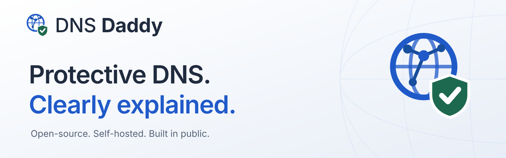
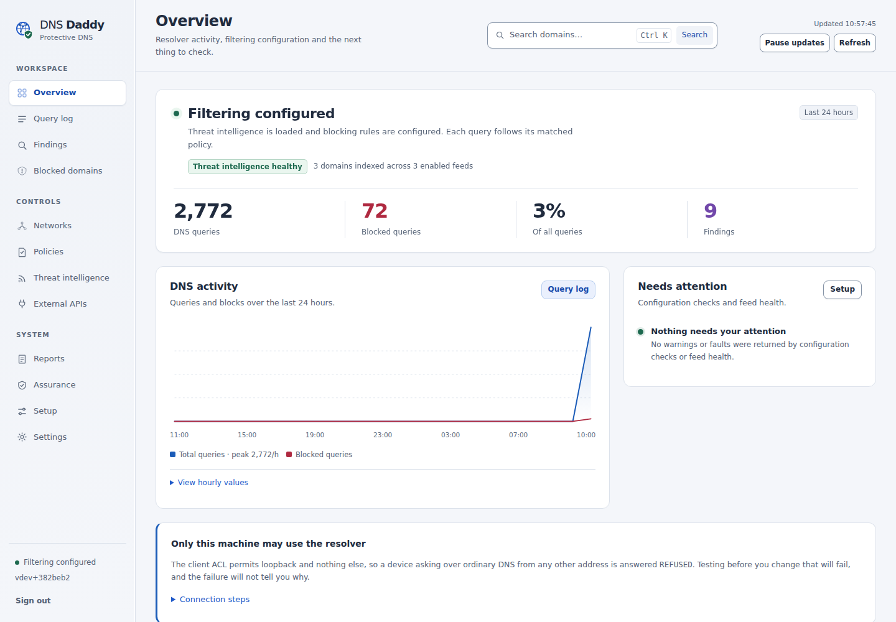
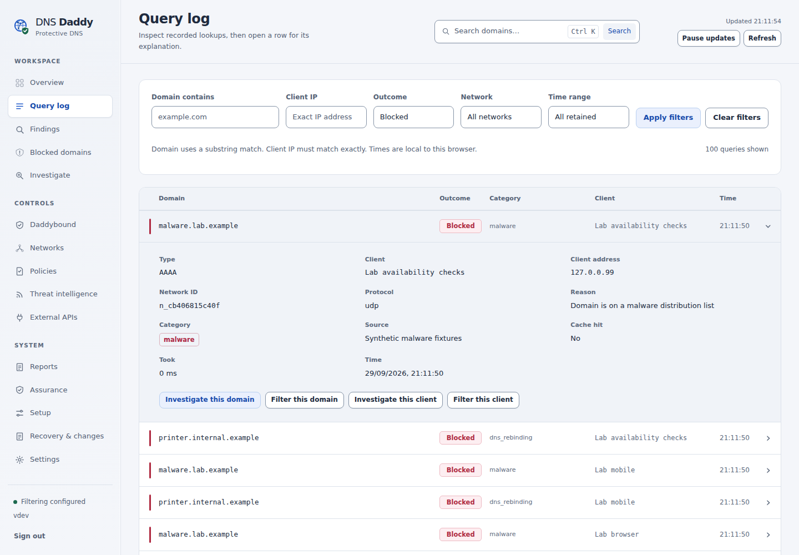
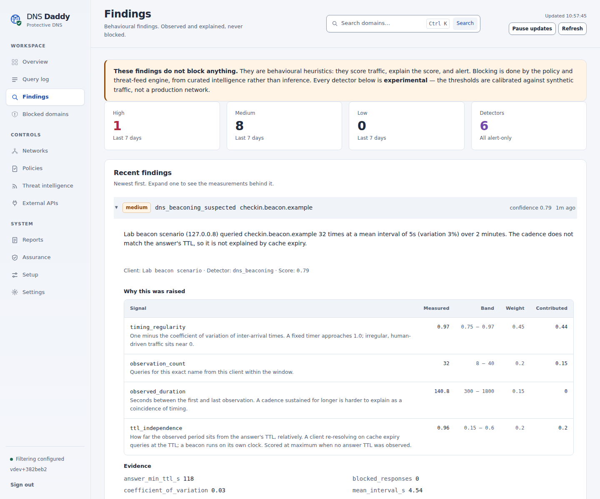
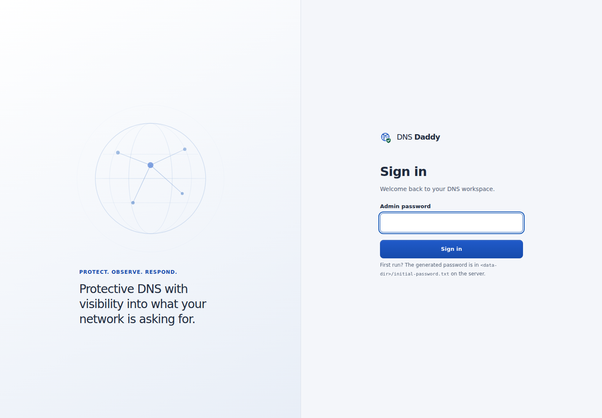
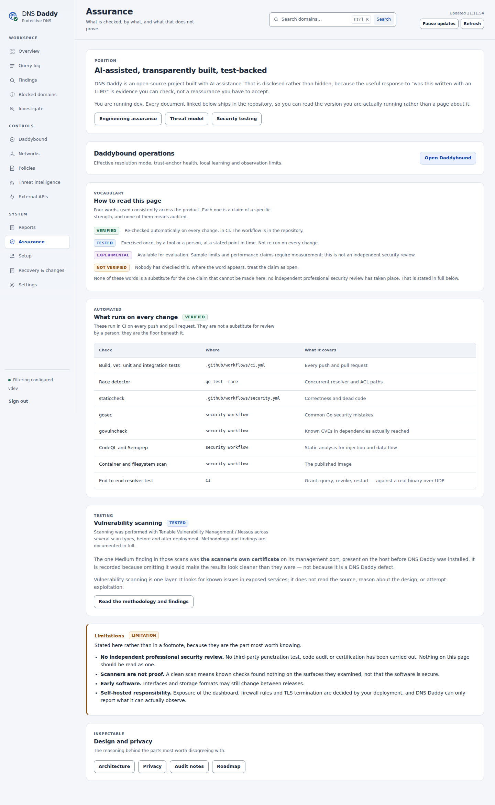
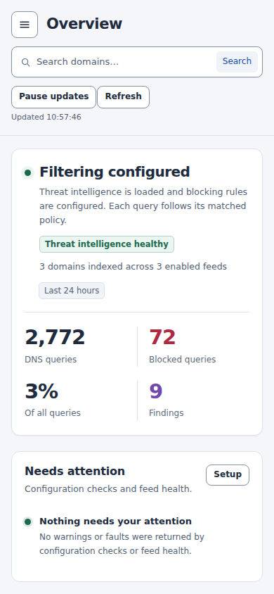

<div align="center">



# DNS Daddy

**A lightweight, self-hosted protective DNS resolver and DNS-security visibility tool.**

Block malicious domains at the resolver. See which device asked for what, why it was stopped, and what your network is asking for — while keeping the telemetry on your own hardware.

**Free & Open Source · No Account · No Trial · No Subscription**

[](https://go.dev)
[](LICENSE)
[](https://github.com/jameshoulder/dnsdaddy/actions/workflows/ci.yml)
[](https://github.com/jameshoulder/dnsdaddy/actions/workflows/security.yml)

</div>

---

> ### Alpha
>
> DNS Daddy works and is actively developed, but it is early software and
> **has not had an independent professional security review**. Run it in
> environments you control. [What is checked, and what none of it
> proves](docs/assurance.md).

## See DNS Daddy in action

Actual application screenshots from the current light interface, using synthetic lab data. [Capture details and source revision](docs/images/SCREENSHOTS.md).

<p align="center">
  
</p>

The overview brings together **query activity, blocks, findings and resolver setup**. It also makes loopback-only resolver access explicit, so you can see when access still needs configuring for other devices.

### Understand a blocked query

<p align="center">
  
</p>

Filter the query log, open a decision and inspect the client, network, source and reason in context. The example above uses a clearly labelled synthetic threat feed.

### Explainable behavioural detections

<p align="center">
  
</p>

DNS Daddy includes six experimental behavioural detectors for DNS tunnelling, beaconing, NXDOMAIN anomalies, DGA-like domains, unusual TXT activity and repeated resolution failures. **They alert and explain; they do not block.**

<details>
<summary>More interface previews: sign-in, assurance and mobile</summary>

### A straightforward control plane

<p align="center">
  
</p>

The web control plane provides a consistent place to configure, observe and investigate a self-hosted resolver.

### Assurance you can inspect

<p align="center">
  
</p>

The **Assurance** page separates what is *verified*, *tested*, *experimental* and *not verified*. DNS Daddy is AI-assisted and early-stage; the project links claims to CI, security testing, threat modelling and documented limitations.

### Useful on a smaller screen

<p align="center">
  
</p>

The same overview adapts to a phone viewport, with navigation available from the menu.

</details>

### Brand assets

The light blue-and-silver identity follows the current interface. [Logo masters, colours and repository artwork](docs/brand/README.md) are available in the **Brand Package 3.0** assets. This is the brand edition, not a software version.

## What is DNS Daddy?

DNS Daddy is a single Go binary that answers DNS for a network. It blocks known-malicious domains using public threat-intelligence feeds, records what happened in plain English, applies different policies to different networks, and raises explainable findings about traffic no feed has heard of yet.

It ships with its own dashboard, a documented REST API, Prometheus metrics, SIEM-friendly exports and a diagnostic command that tells you why DNS is not working when it is not working.

It is aimed at the space commercial protective-DNS platforms occupy — Cisco Umbrella, Cisco Secure Access, DNSFilter and the like — but from the other direction: **lightweight, self-hosted and inspectable**. It makes no claim to their capability, assurance, scale or support.

## Why would I use it?

Public resolvers like Quad9 and Cloudflare can block known-bad domains. What they cannot give you locally is:

- **which device** made the request,
- **why** DNS Daddy blocked it and which feed said so,
- whether one endpoint has been quietly **beaconing** to the same infrastructure,
- or an inspectable **record** of what happened on your own network.

| | |
|---|---|
| **See what a network actually resolves** | A homelab or small office where nobody has ever looked at DNS traffic before. |
| **Investigate a device** | “This laptop was flagged — what has it been asking for?” |
| **Learn protective DNS** | The code, threat model and detector maths are readable, and there is an offline lab. |
| **Keep telemetry in-house** | No account, no cloud tenant and no requirement to upload query logs. |
| **Feed a SIEM** | Findings and query data as documented, versioned NDJSON. |

## What you get

| | |
|---|---|
| **Threat blocking** | Malware, phishing, C2 and cryptomining on by default. Additional categories are available. |
| **Plain-English logs** | Recorded queries explain what happened and why, subject to configured privacy, retention and bounded logging queues. |
| **Per-network policies** | Match clients by CIDR, including different sites and VLANs. |
| **Instant allow-listing** | Clear a false positive from the dashboard and purge the cached answer. |
| **Daddybound Live** | Fresh installations use the experimental native recursive resolver and DNSSEC validation. Existing Off/Learn selections are preserved on upgrade. |
| **Forwarding modes** | Learn and Off use configured upstreams, with DNS-over-TLS configured by default. Native Live uses plaintext authoritative UDP/TCP 53. |
| **DoH and DoT** | Serves DNS-over-HTTPS and DNS-over-TLS as well as plain DNS. |
| **Behavioural detection** | Six experimental heuristics plus a local learned baseline, with explainable measurements and no automatic heuristic blocking. |
| **Self-diagnosis** | `dnsdaddy doctor` explains configuration, listener, ACL, upstream and threat-intelligence problems. |
| **Investigation and policy preview** | Domain/client history, original decisions, current evidence, findings and native observations in one workflow. Policy preview is read-only and does not silently contact external providers. |
| **Finding review** | Acknowledge, resolve, classify false positives and add notes with versioned review history, preserving original evidence. |
| **Operational protection** | Bounded per-client rate limiting and IPv4/IPv6 rebinding checks, with explicit internal/split-DNS exceptions and counters. |
| **External APIs** | Add your own VirusTotal, Safe Browsing or custom HTTP/JSON credentials safely in the UI, with separate tests and outbound consent. |
| **Recovery and change history** | Redacted management change history, encrypted backups including credential keys and learned/native state, and verified restore into a fresh directory. |
| **Exports and notifications** | Complete paginated query/decision/finding NDJSON exports and an optional signed HTTPS webhook with bounded asynchronous delivery. |
| **Open by construction** | OpenAPI, Prometheus metrics, public threat-feed catalogue and documented design decisions. |

## DNS Daddy + Pi-hole

**DNS Daddy is not a Pi-hole replacement.** Pi-hole is excellent at blocking ads and trackers. DNS Daddy focuses on protective DNS, threat intelligence, explainable security decisions and visibility into what devices are resolving.

The two can run together. In **Learn or Off mode**, DNS Daddy can sit in front with Pi-hole as its configured upstream, retaining per-client identity while Pi-hole handles ad/tracker blocking. Live performs native recursion and does not forward client questions through Pi-hole.

See **[docs/pi-hole.md](docs/pi-hole.md)** for the topology options, trade-offs and current evidence level.

## Quick start

### Prerequisites

The Docker quick start expects:

- Git
- Docker Engine
- Docker Compose v2 (`docker compose`)

Check them first:

```bash
git --version
docker --version
docker compose version
```

Then:

```bash
git clone https://github.com/jameshoulder/dnsdaddy.git
cd dnsdaddy
./deploy/install-docker.sh
```

Use `--dry-run` first if you want to see what the installer would do without changing anything. `--upgrade` rebuilds and restarts while keeping your data and `.env`; `--uninstall` stops the deployment while keeping your data.

> `./deploy/install-docker.sh` configures and launches DNS Daddy. It does **not** install Git, Docker Engine or Docker Compose for you.

### Reaching the dashboard

The installer provides three deployment modes:

| | Dashboard reached by | Backend binds | Use when |
|---|---|---|---|
| **LAN** (`--lan`) | `http://<lan-ip>:8080` | LAN address | the machine genuinely has no public exposure |
| **SSH tunnel** (`--vps`, default) | `http://127.0.0.1:8080` through SSH | loopback | public VPS or when unsure |
| **HTTPS** (`--https`) | HTTPS through Caddy | loopback | public VPS where TLS termination is desired |

The SSH-tunnel mode is the safe default for a public VPS:

```bash
ssh -L 8080:127.0.0.1:8080 you@your-server
# then open http://127.0.0.1:8080
```

For HTTPS, the architecture is:

```text
internet → :443 Caddy (TLS) → 127.0.0.1:8080 DNS Daddy
```

See **[docs/deploy.md](docs/deploy.md)** for firewalling, Caddy, TLS, upgrades, backups and uninstall guidance.

### First-run password

The generated first-run password is stored on the server at:

```text
<data-dir>/initial-password.txt
```

For the Docker deployment this is inside the DNS Daddy data volume and can be read with:

```bash
docker compose exec dnsdaddy cat /var/lib/dnsdaddy/initial-password.txt
```

Change the password from **Settings**, then remove the initial-password file when you no longer need it.

### Allow the clients that should use it

DNS Daddy deliberately refuses DNS queries from source addresses it has not been told to serve. On a LAN, the shipped defaults cover private ranges. On a public VPS, add the authorised client or network in **Networks** and enable resolver access for it.

The effective ACL is the configured allowed CIDRs plus networks explicitly permitted through the dashboard. See [docs/deploy.md](docs/deploy.md#who-may-use-the-resolver).

## Diagnose before rollout

Run `dnsdaddy doctor` **before** changing router or DHCP DNS settings:

```bash
docker compose exec dnsdaddy dnsdaddy doctor
```

Then test from another machine:

```bash
nslookup example.com <dnsdaddy-ip>
dig @<dnsdaddy-ip> example.com
```

Point **one device** at DNS Daddy first and watch the query log before rolling it out network-wide. A DHCP-level mistake can take DNS down for everyone at once.

## See it working without real traffic

The offline lab creates synthetic DNS clients and a synthetic upstream so you can exercise the resolver and detectors without contacting malicious infrastructure:

```bash
docker compose --profile lab up --build
# dashboard: http://127.0.0.1:8081
# password: dnsdaddy-lab-demo-password
```

The lab includes benign and detection-triggering scenarios, including tunnelling, NXDOMAIN anomalies, suspicious TXT activity, DGA-like domains and beaconing. Everything uses `.example` or `.test` names and seeded synthetic traffic.

See **[labs/README.md](labs/README.md)**.

## Detection, and what it deliberately does not do

Blocking a domain because it is on a threat feed and inferring malicious intent from DNS behaviour are different problems.

**None of DNS Daddy's behavioural detectors block anything.** They are heuristics, they can have false positives, and their thresholds are currently calibrated against synthetic traffic rather than a production corpus. Every detector is therefore marked **experimental**.

Findings publish the measurements behind the score so an analyst can inspect the evidence rather than accept an opaque severity label. Full detail: **[docs/detection/README.md](docs/detection/README.md)**.

## Threat intelligence

Default threat intelligence comes from public, no-registration sources listed in [`internal/catalog/catalog.go`](internal/catalog/catalog.go), including abuse.ch URLhaus, Phishing Army, The Block List Project, HaGeZi and CoinBlockerLists.

Downloaded feeds are cached to disk. A failed or malformed refresh keeps the last-known-good index rather than emptying it.

The project-operated **Threat Observatory** integration has been retired. Its built-in feed is removed from the active catalogue and disabled on existing installations; recorded history is retained. Extension now centres on **your own external APIs and credentials**, with deliberate consent before outbound lookup or delivery.

See **[docs/threat-intel.md](docs/threat-intel.md)**.

## Security and assurance

DNS Daddy is an **AI-assisted open-source project**. AI assistance is implementation support, not security review.

On every change the project runs combinations of build/test, race detection, `staticcheck`, `gosec`, `govulncheck`, CodeQL, Semgrep, container scanning and end-to-end resolver tests. Security testing and design limitations are documented in the repository.

**It has not undergone an independent professional security review.** There has been no independent penetration test, third-party code audit or certification. Automated scanners and CI do not substitute for one.

Start with:

- **[docs/assurance.md](docs/assurance.md)** — what is checked, by what, and what none of it proves
- **[docs/security-testing.md](docs/security-testing.md)** — security-testing methodology and evidence
- **[docs/threat-model.md](docs/threat-model.md)** — assets, trust boundaries, threats and mitigations
- **[docs/audit-2026-08.md](docs/audit-2026-08.md)** — latest documented audit and reviewer guide
- **[SECURITY.md](SECURITY.md)** — responsible vulnerability disclosure

## Honest limitations

Worth knowing before you rely on DNS Daddy:

- **No independent professional security review.** Automated testing and implementation evidence are not an independent audit.
- **Native Live is experimental.** It is the fresh-install default, but production reliability, constrained-hardware performance and long-running key-rollover behavior are not established. Existing Off/Learn selections survive upgrades.
- **Native traffic is plaintext authoritative DNS.** Live sends UDP/TCP 53 traffic to authoritative servers; the encrypted forwarding upstream does not protect this path. Learn adds independent native observation traffic alongside forwarded answers.
- **Live does not silently fall back.** Bogus, indeterminate, timeout and bounded-work failures return SERVFAIL. Review the mode and network egress requirements before activation.
- **Learning and behavioural findings are alert-only.** A learned anomaly is not a maliciousness probability. The checked-in evaluation is synthetic and contains false alerts and misses; there is no measured production false-positive rate.
- **Rebinding exceptions require deployment knowledge.** Legitimate split-DNS/private answers need explicit exceptions; exceptions are not learned automatically from traffic.
- **Recovery has explicit boundaries.** Backups capture consistent SQLite data and committed auxiliary files, not every in-flight observation. Restore is offline into a new directory; service/firewall/reverse-proxy configuration is not recreated.
- **Browser DoH can bypass network DNS.** Mitigations require network/endpoint configuration.
- **No clustering, anycast, SSO, RBAC or multi-tenancy.** One DNS Daddy instance is one server with an administrator account and API tokens.

**[docs/capabilities.md](docs/capabilities.md)** is the authoritative capability map: available, experimental and planned.

### Daddybound: native DNS plus local learning

Daddybound now has two distinct responsibilities: native DNS resolution and
DNSSEC validation, and a local incremental model of client DNS behaviour.
Cryptographic validation and statistical anomaly detection make different
claims and remain visible as separate evidence.

| Native mode | Client answer path | Behavior |
| --- | --- | --- |
| **Live** (`enforce`) | Daddybound authoritative recursion | Returns secure or proven-insecure answers; bogus, indeterminate and operational failures return SERVFAIL. Validation is bound to the records actually returned. |
| **Learn** (`observe`) | Configured forwarding upstream | Resolves allowed names independently after their answers are decided and records native observations without changing those answers. |
| **Off** (`off`) | Configured forwarding upstream | Stops native resolution and anchor refresh. Local policy, rate limiting and rebinding protection remain active. |

**Fresh installations default to Live.** Upgrades preserve recorded Off/Learn
choices. Explicit YAML mode settings pin the choice; otherwise the dashboard
can save an acknowledged mode change. Native authoritative traffic uses
plaintext UDP/TCP port 53 with QNAME minimisation. A client DNSSEC CD request
skips cryptographic checking only; policy and rebinding checks still apply.

The native engine implements DNS/DNSSEC protocol and trust logic in Go,
using established cryptographic primitives and the DNS wire library. It
handles chain validation, NSEC/NSEC3 denial, CNAME/DNAME processing and managed
RFC 5011 anchors. libunbound and BIND `delv` are differential test oracles,
not the implementation that produces Daddybound's verdicts.

**Local learning is enabled by default and never blocks by itself.** It learns
bounded per-client baselines for query rate, label length/entropy, name
diversity, TXT usage and label count. It warms up from eligible five-minute
windows, compares later windows with the previous baseline, and updates
parameters gradually. It excludes blocked, failed, partial, saturated and
strongly anomalous windows from normal-baseline updates. Persisted checkpoints
carry fitted parameters and sample counts, not raw queried names.

A ready baseline is not proof of accurate detection. Warm-up contamination,
gradual changes and benign application changes remain limitations. The UI
shows sample counts, exclusions, persistence health and uncalibrated anomaly
distance. The [evaluation report](labs/evaluation/RESULTS.md) publishes
synthetic test populations and investigated misses/false alerts with their
denominators.

Read **[Daddybound](docs/daddybound/README.md)** and
**[local learning](docs/learning.md)** for the implementation and its limits.

## Resource target

DNS Daddy is intentionally designed to run on small infrastructure. A 1 GB / 1 vCPU VPS is the reference class, with threat-intelligence memory use scaling with the number of indexed domains and disk use scaling with retained query volume.

The 1 GB / 1 vCPU figure is a design target, not a fresh benchmark of native Live, learning and all optional integrations together. Work queues and state are bounded; workload-dependent performance still needs deployment measurement.

## Configuration

Configuration is YAML with `DNSDADDY_*` environment variables taking precedence. Every option is documented in **[`dnsdaddy.example.yaml`](dnsdaddy.example.yaml)**.

The example below explicitly selects Learn mode so these encrypted upstreams answer client queries. Omit the explicit mode only when the installation default or saved dashboard selection is intended.

```yaml
dns:
  local_dnssec_validation: observe
  upstreams:
    - "tls://9.9.9.9:853#dns.quad9.net"
    - "tls://1.1.1.1:853#cloudflare-dns.com"
log:
  query_log: true
  log_client_ip: true
  retention_days: 7
```

## API and integrations

Every resolver serves an OpenAPI 3.1 specification at `/openapi.yaml`. Prometheus metrics are available at `/metrics`, and versioned exports are available for SIEM workflows.

The **External APIs** page lets each operator add their own provider credentials, save configuration, run a deliberate connection test and choose how the provider may contribute. Reputation starts Off and enrichment starts disabled. Saving a disabled provider makes no external call. Enabling/testing a provider requires consent; synchronous blocking reputation also requires accepting its DNS latency budget.

Credentials are write-only and encrypted with a separate local master key. The project does not supply shared accounts or API keys. Current built-in adapters are VirusTotal v3, Google Safe Browsing Lookup and Custom HTTP/JSON; adapter fixtures and an operator’s successful connection test are reported separately.

Optional signed webhooks deliver new finding events and, when selected, review events to the operator’s own HTTPS receiver. Delivery is bounded and asynchronous, with persistent counters and at-least-once semantics. Receivers should deduplicate using the event ID.

Network/SIEM guidance includes pfSense, OPNsense, UniFi, FortiGate, Windows Server, Wazuh, Elastic, Splunk and Sentinel.

See:

- [docs/external-apis.md](docs/external-apis.md)
- [docs/webhooks.md](docs/webhooks.md)
- [docs/exports.md](docs/exports.md)
- [docs/recovery.md](docs/recovery.md)
- [docs/integrations.md](docs/integrations.md)
- [docs/siem.md](docs/siem.md)
- [internal/api/openapi.yaml](internal/api/openapi.yaml)

## Documentation

**[docs/](docs/) is intended to be a DNS-security knowledge base as well as product documentation.**

| | |
|---|---|
| **[docs/capabilities.md](docs/capabilities.md)** | Available / experimental / planned — start here |
| [docs/assurance.md](docs/assurance.md) | What is checked and what none of it proves |
| [docs/audit-2026-08.md](docs/audit-2026-08.md) | Audit findings, fixes and reviewer guide |
| [docs/threat-model.md](docs/threat-model.md) | Assets, boundaries, threats and mitigations |
| [docs/detection/](docs/detection/) | Detection engineering and finding schema |
| [docs/learning.md](docs/learning.md) | Local fitted baselines, privacy, warm-up and limitations |
| [docs/external-apis.md](docs/external-apis.md) | Provider credentials, consent, modes and testing |
| [docs/recovery.md](docs/recovery.md) | Configuration history and encrypted backup/restore |
| [docs/exports.md](docs/exports.md) | Complete paginated exports and retention limits |
| [docs/webhooks.md](docs/webhooks.md) | Signed asynchronous event delivery |
| [docs/threat-hunting/](docs/threat-hunting/) | Threat-hunting workflows |
| [docs/dns-security/](docs/dns-security/) | Protective DNS, DNSSEC, DoH/DoT and bypass |
| [labs/](labs/) | Offline lab and synthetic scenarios |
| [docs/siem.md](docs/siem.md) | SIEM integrations |
| [docs/threat-intel.md](docs/threat-intel.md) | Threat feeds and false-positive handling |
| [docs/privacy.md](docs/privacy.md) | Data storage and privacy controls |
| [docs/architecture.md](docs/architecture.md) | Query flow and architecture |
| [docs/roadmap.md](docs/roadmap.md) | Future work and prerequisites |
| [CONTRIBUTING.md](CONTRIBUTING.md) | Development setup and contribution guidance |

## Help wanted

DNS Daddy is a solo project and external evidence is particularly valuable.

Useful contributions include:

- independent review of the resolver, policy attribution, authentication and threat-feed handling,
- deployment testing across Ubuntu, Debian, cloud VPSes and virtualisation platforms,
- real-world Pi-hole integration testing,
- security testing within environments you own or have explicit permission to test,
- well-described bugs, documentation fixes and reproducible deployment failures.

Report security-sensitive findings privately through **[SECURITY.md](SECURITY.md)**.

## ☕ Support the project

DNS Daddy is free, open source and self-hosted. There are no paid tiers or supporter-only features.

If you find it useful and want to support hosting, testing and development, you can [buy me a coffee](https://buymeacoffee.com/jameshoulder). Contributions, code review, testing and bug reports are equally welcome — and often more useful.

## Project status

**Alpha. Actively developed, not independently reviewed, and free — permanently.**

| | |
|---|---|
| Maintained by | One person, in spare time |
| Licence | Apache-2.0 |
| Independent security review | **None** |
| Core DNS resolution | Tested and fuzzed |
| Behavioural detection | **Experimental**, alert-only |
| API | Versioned under `/api/v1` with OpenAPI |
| Breaking changes | Recorded in [CHANGELOG.md](CHANGELOG.md) |

DNS Daddy began as a cybersecurity Master's project exploring how a small, transparent protective DNS platform could work without enterprise infrastructure. It has since developed into an open-source project with an explicit emphasis on inspectability, evidence and documented limitations.

## Licence

[Apache-2.0](LICENSE).
