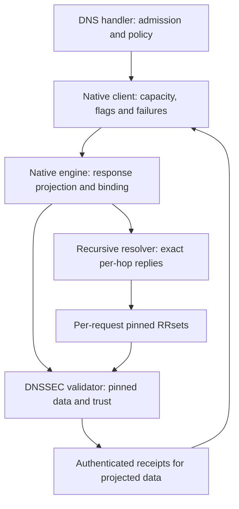

# Daddybound architecture

## The packages

| Package | Responsibility |
| --- | --- |
| `dnssec` | Chain/proof validation and exact authenticated-RRset receipts |
| `recursive` | Root priming, iterative lookup, aliases, material cache and bounded transport |
| `native` | Bind validation to native client content; CD/DO/AD and failure adapter |
| `trustanchors` | Persisted RFC 5011 trust-point lifecycle |
| `observe` | Independent bounded Learn workers |
| `lab` | Deterministically signed test hierarchies |
| `differential` | Comparison against independent reference validators |
| `differential/refunbound` | libunbound oracle behind its test build tag |

The native request relationship is:



The handler applies rebinding checks before sending a native answer. It
selects this route before the forwarding cache; no failure transitions from
native to forwarding. Learn uses the engine separately after a forwarded
answer is final. The mode controller reuses one native runtime between Live
and Learn and shuts it down when Off is selected. See
[ADR 0003](../decisions/0003-daddybound-native-live.md).

`dnssec` imports nothing from DNS Daddy. Not the store, not the config, not
the resolver. That is enforced by a test rather than by convention — see
[security-model.md](security-model.md) — and the reason is that a verdict
which depended on deployment state could not be reproduced from a recorded
trace, which would make the whole evidence model worthless.

## Why `dnssec` is one package

The brief for this milestone named a package per concern: chain, trustanchor,
dnskey, ds, rrsig, canonical, algorithms, policy. Those are the file names
inside `dnssec` rather than separate packages, and the reason is that these
concerns are genuinely mutually dependent: the chain walk needs RRSIG
admissibility, which needs canonical form, which needs the algorithm table,
which the chain walk also consults directly. Splitting them into packages
would produce either an import cycle or a set of interfaces that exist only to
break one — abstraction with no reader and no second implementation.

The seams that *are* package boundaries are the ones with a real reason:

- **`lab` is separate** because it generates private keys and signs zones. It
  has no business being linkable from anything that validates.
- **`differential` is separate** because it exists to be pointed at more than
  one oracle.
- **`refunbound` is separate** because it is the only cgo in the repository,
  and containing it in one package makes "nothing we ship links libunbound" a
  statement about one directory.

## The seams inside `dnssec`

Three interfaces, each with a reason to exist beyond tidiness.

### `Source`

```go
type Source interface {
    Lookup(ctx context.Context, name string, rrtype uint16) (Response, error)
}
```

Separates validation from retrieval, and the separation has been exercised in
both directions: the laboratory holds a complete hierarchy in memory, and
`internal/daddybound/netsource` reads from a recursive resolver over the
network. The same validation code runs against both without changing, which is
what the interface was for. Nothing above it knows where records came from.

Its contract carries one subtlety that shapes the engine: returning no records
and no error means "no records of this type as far as I know", which is *not*
a proof that none exist. The chain walk treats those very differently, and
[standards.md](standards.md) §5.5 explains what it does about the difference.

### `SignatureVerifier`

```go
type SignatureVerifier interface {
    Verify(alg Algorithm, keyData, signed, sig []byte) Reason
}
```

The boundary between trust logic and cryptography. Above it, code decides
*whether* a signature should be trusted. Below it, code answers only *whether
the arithmetic holds* and is allowed no opinion about anything else.

It returns a `Reason` rather than a `bool` because there are three outcomes,
not two: verified, did not verify, and could not attempt. Collapsing the third
into the second would report an algorithm this build cannot handle as a
signature failure, which blames a correctly signed zone for a build option.

### `Clock`

```go
type Clock interface{ Now() time.Time }
```

RFC 4035 §5.3.1 phrases both validity checks against "the validator's notion
of the current time", which is an unusually direct invitation to make it a
value. Both bounds are inclusive, and a validator that reads the wall clock
cannot be tested on either boundary second.

## Support and permission are different questions

`Algorithm.Supported()` asks whether this build has a verifier.
`Policy.AllowsAlgorithm()` asks whether an operator will rely on it. They are
separate because RFC 9905 §2 imposes both obligations at once for RSASHA1:

> Validating resolver implementations … MUST continue to support validation
> using these algorithms … Operators of validating resolvers MUST treat DNSSEC
> signing algorithms RSASHA1 and RSASHA1-NSEC3-SHA1 as unsupported …

A design with one boolean per algorithm has to violate one of those. So the
implementation keeps the capability, the default policy refuses to use it, and
the two failures have distinct reasons so a trace never conflates them.

## The trusted computing base

`canonical.go` is the part everything else rests on. Every verdict is
ultimately a statement about the bytes it produces, and there is no check
further down that catches an error at this level: each downstream step still
runs, still looks correct, and answers a question nobody asked — confidently.

Its tests therefore assert *bytes* against the RFC's rules rather than
asserting that a library was called. A library upgrade that changed canonical
packing fails them; a test that only checked the call happened would not.

## The result and the trace

```go
type ValidationResult struct {
    Status ValidationStatus   // RFC 4033's four, zero value Indeterminate
    Reason Reason             // typed, never parsed from text
    Steps  []ValidationStep   // ordered, deterministic
    At     time.Time          // the clock this run used
}
```

Three properties are deliberate:

**The zero value is Indeterminate.** A result nobody filled in reads as an
admission rather than a claim. A zero value meaning Secure would turn every
forgotten assignment into a false Secure.

**Reasons are typed constants.** Human wording is generated from a `Reason`
and never parsed back. Nothing decides anything by matching an English
sentence.

**Traces are deterministic.** Nothing in the walk iterates a map to produce a
step. A trace that reorders between runs cannot be diffed — not against an
earlier run and not against a reference validator's — and evidence that cannot
be diffed is not evidence. A test runs every scenario six times over
and compares.

Construction goes through an unexported recorder whose only exits are the
terminal methods, so there is no path that produces a result without also
having recorded how it got there.

## Exact client-content receipts

`ValidationResult.Authenticated` contains unexported-content receipts for
RRsets whose signatures verified. The native engine compares their canonical
digests against each returned RRset and caps TTL by the accepted signature's
lifetime. These receipts are excluded from JSON; stored textual traces cannot
be replayed as permission to authenticate a different packet.

`ValidateQuestions` shares lookup and NSEC3 hash budgets across all projected
client RRsets. Whole-question pins preserve NXDOMAIN/NODATA proof context;
individual RRset pins bind alias targets and negative SOA records without
replacing them with a different lookup's answer. This closes the distinction
between proving a question and authenticating everything served under AD.
