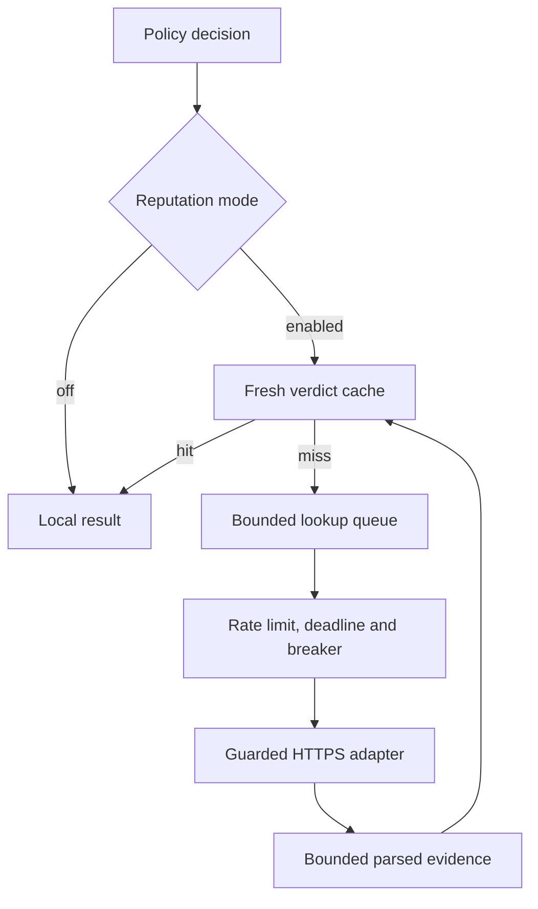

# Bring your own intelligence: external API providers

Configure external intelligence under **External APIs** in the dashboard. No YAML edit or restart is needed to add a provider, save a credential, test it, enable it, or change the reputation and investigation-enrichment modes.

Each installation uses its operator's own provider accounts and API credentials. DNS Daddy supplies adapters, not API subscriptions, shared credentials or a hosted intelligence service. The bundled Threat Observatory connector has been retired; see [threat intelligence](threat-intel.md).

## 1. Defaults and onboarding

The management engine starts with the resolver so that setup is always available. Its default reputation mode is **off**, investigation enrichment is **off**, and a newly saved provider is **disabled** unless the operator explicitly enables it. An idle engine sends no provider requests.

On the first upgrade to UI-managed preferences, a transaction captures the old effective state: a legacy `integrations.enabled: false` remains off, and an enabled installation's saved reputation choice remains bounded by its old YAML ceiling. The old enrichment gate is preserved too. A version marker is saved with those choices, so old settings cannot silently enable external sharing or introduce a blocking wait on upgrade. After this migration, explicit UI saves become the durable authority and survive later restarts without a YAML ceiling. If migration or marked-state validation fails, the engine remains available for repair with reputation and enrichment off.

The intended sequence is:

1. Choose a provider and read its disclosure about which domains leave the resolver.
2. Enter non-secret settings and your own credential in its separate password field.
3. Save the provider disabled. Saving and reading configuration make no provider request.
4. Explicitly consent to **Test connection**. This makes a real request using the saved credential; where there is no health endpoint, the test looks up `example.com`.
5. Enable that provider and the desired reputation or enrichment mode after acknowledging domain sharing. Enabling a provider alone does not change the default global off mode.

Normal DNS resolution still contacts the upstream or authoritative servers configured for Daddybound. External intelligence is an additional, separately controlled disclosure. A provider may retain queried names, apply licence conditions, or charge per request.

The stock adapters are:

| Kind | Behaviour | Credential |
|---|---|---|
| `virustotal` | VirusTotal v3 domain reputation and context | Your VirusTotal API key |
| `safebrowsing` | Google Safe Browsing v4 Lookup request | Your Google API key |
| `customhttp` | GET or POST to a configured HTTPS URL template, parsing declared score/verdict fields from JSON | Optional encrypted key/token in a declared header or query parameter |

Custom HTTP is a declarative adapter, not arbitrary scripting, OAuth orchestration, or a general request-body editor. Services with a different authentication or response contract need a dedicated adapter. The package also defines a `feed` interface for future adapters; bulk feeds in the current UI are managed separately under Threat feeds.

## 2. What the modes do

| Mode | During DNS resolution | External requests |
|---|---|---|
| `off` | Does not consult API reputation | None from the reputation path |
| `cache_only` | Reads fresh cached verdicts; a cached malicious verdict can block | A miss can enqueue a background request, while the DNS answer proceeds |
| `blocking` | Uses the cache, then waits within the configured reputation budget | A miss can request a provider answer; expiry/error gives unknown |

Unknown, timeout and provider failure do not themselves block a domain. Local policy decisions take precedence. **Cache-only does not mean “no sharing”**: it avoids waiting for a live result, while permitting asynchronous requests on misses.

Enrichment is a separate toggle. A consented investigation POST can enqueue context from enabled enrichment-capable providers in the selected policy scope even when reputation mode is off. The response reports how many tasks were actually accepted. All GET investigation, policy-preview, template, settings and health endpoints remain local and do not contact providers.

A settings request enabling sharing requires `consent: true`. Blocking reputation also requires `acceptDnsLatency: true`. Turning modes off needs no consent. Workers check the current mode and provider instance again before starting queued work, so disabled or superseded configurations are not used for pending calls. An already transmitted request cannot be recalled.

## 3. Architecture and bounds

The lookup queue drops and counts overflow instead of applying back-pressure to DNS. The default worker count is two, queue capacity 1,024, in-memory cache capacity 4,096 and blocking budget 50 ms. These resource defaults remain deployment configuration. The API accepts at most 64 providers, timeout at most 15 seconds, rate at most 6,000 calls/minute and cache TTL at most 30 days; individual adapters have lower suggested defaults.

Every provider response is read with a 1 MiB bound. Scores are clamped, evidence excerpts bounded and credentials redacted before evidence is persisted. The client uses a per-provider rate limiter, a circuit breaker and one bounded retry for appropriate failures. These bounds do not imply that an API plan's quota is sufficient: choose a rate compatible with your own account.

## 4. Credential storage and recovery

Provider credentials are write-only through the API. They are sealed with AES-256-GCM in `api_provider_secrets`, bound to the provider ID, using the key file `secrets.key` in the data directory. Reads return only `secretSet` and a short hint. Changing the adapter kind in-place is refused, so a stored key cannot silently be reinterpreted as another vendor's credential.

A provider is initially inserted disabled; it is enabled only after a requested credential has been encrypted successfully. If encryption fails, an inert draft can remain for correction. Configuration and credential changes revoke the old work generation, cancel queued/rate-waiting/in-flight calls where possible, and reject their late results. The handler waits for an already-started local result commit before changing the configuration. Stored reputation and enrichment entries are atomically expired by that change, so a restart cannot revive old cache authority; their original evidence values remain available until normal retention removes them. Rotation also invalidates prior connection-test evidence. Removing a credential disables that provider. Data already sent to a provider cannot be recalled.

Endpoint URLs and other `config` values are non-secret and readable by authenticated administrators. Do not place tokens in them. Configuration validation rejects URL user information, credential-bearing query parameters, unknown settings and invalid authentication headers. Custom `auth_query` stores the **parameter name** only; the encrypted key is added at request time. A credential prefix preserves meaningful trailing whitespace, such as `Bearer `.

A database-only copy does not provide the key needed to decrypt credentials. A usable protected recovery bundle must include the matching `secrets.key`, and then that bundle must itself be treated as sensitive. [Recovery documentation](recovery.md) describes the implemented backup/restore process. Loss of the key prevents affected providers from authenticating and is reported; it does not stop DNS resolution.

## 5. HTTPS and destination controls

Production providers use verified HTTPS. Redirects are not followed, and environment HTTP/HTTPS proxies are ignored because a proxy could resolve the destination itself and bypass local address checks.

Validation at save time examines the URL without DNS or network access. At request time each actual resolved address is checked before connecting. A hostname changing its answers between requests therefore cannot bypass destination checks. Public unicast is the default. Loopback, link-local, cloud metadata, unspecified, multicast, reserved/documentation and IPv4-embedding special ranges are refused.

For an operator-owned internal reputation service, the Custom HTTP setting `allow_private: "true"` explicitly permits RFC 1918 and IPv6 ULA destinations. It preserves TLS certificate verification and still refuses loopback and cloud metadata, including `fd00:ec2::254`. Use a certificate trusted by the host; there is no insecure-certificate switch.

This protects the request destination. It does not make a chosen provider trustworthy: an enabled provider's cached malicious verdicts can influence blocking. Review the provider, its data handling and your configured policy scope. Local rate, size and time limits remain active regardless of the destination.

## 6. Management API

All routes below require authenticated management access and the existing CSRF checks where applicable. Bodies shown omit credentials intentionally.

| Method and path under `/api/v1` | Purpose |
|---|---|
| `GET /integrations/settings` | Availability, encryption readiness, effective modes and privacy notice; no network |
| `PUT /integrations/settings` | Save `reputationMode`, `enrichmentEnabled`, `consent` and, for blocking, `acceptDnsLatency` |
| `GET /integrations/templates` | Compiled adapter fields, disclosure, defaults and verification statement |
| `GET /integrations/providers` | Saved providers, current instances, engine counters and test records |
| `POST /integrations/providers` | Create a provider; `secret` is write-only, enabling requires consent |
| `GET /integrations/providers/{id}` | One provider; no network |
| `PATCH /integrations/providers/{id}` | Update non-secret settings; enabling or widening sharing requires consent |
| `DELETE /integrations/providers/{id}` | Remove the provider, credential and cached API records |
| `POST /integrations/providers/{id}/secret` | Set/rotate the encrypted credential |
| `DELETE /integrations/providers/{id}/secret` | Remove credential and disable provider |
| `POST /integrations/providers/{id}/test` | Explicit live test with `{ "consent": true }` |
| `POST /integrations/providers/test` | Explicit test of an unsaved candidate; does not persist its credential |
| `GET /integrations/providers/{id}/health` | Read counters and current error; no network |
| `PUT /integrations/reputation` | Compatibility route for `{ "mode", "consent", "acceptDnsLatency" }` |
| `POST /investigate/domain/{domain}/enrich` | Consent-gated investigation lookup/enrichment in current modes and policy scope |

The saved UI values are `integrations.reputation_mode` and `integrations.enrichment` in the settings table. They take precedence at restart. Legacy YAML mode/enrichment values provide an initial value only when the old deployment had integrations enabled; `integrations.enabled: false` no longer hides management setup or imposes a restart requirement.

## 7. Operational evidence

The engine reports mode, bounded queue size/depth, accepted/dropped/completed work and cache activity. Each loaded provider reports client counters, latency, failures and circuit state. `errorRate` divides failed logical transport calls by `calls`; circuit-denied work is counted separately in `rejected` and does not inflate that ratio. Engine counters describe the current process; individual provider clients are rebuilt on configuration reload, so their counters can reset on an edit. Transport errors are reduced to safe categorical messages before they can enter logs, saved test outcomes or health responses; a query-authentication URL is never copied into the error text.

The optional signed [webhook receiver](webhooks.md) has separate durable queue and delivery counters. Its configuration and credentials are independent of the provider adapters.

## 8. What a test proves

The shipped adapter implementations are covered by local fixtures; their template-level `liveVerified` remains false. This build does not claim the maintainers have exercised your subscription or the current vendor service with your credential.

Your explicit saved-provider test records `lastTest` with its result, time, latency and configuration fingerprint. That is a record of one connection test for your configuration. It neither changes the template's verification claim nor demonstrates detector accuracy, recall, production reliability or quota sufficiency. A rate-limited test is inconclusive and is not recorded as successful. Endpoint/key changes invalidate the previous test record. Tests do not warm the reputation cache.

Automated coverage includes credential redaction, encryption identity binding, consent refusal before network access, read-only GETs, mode persistence, blocked literal and DNS-resolved destinations, explicit internal-address rules, queue revocation, bounded responses/retry behaviour, and configuration resource limits. All transport fixtures remain local; no real provider accounts are required by the test suite.

## 9. Adding a provider

Add a constructor and template under `internal/apiprovider/adapters`, registering the stable kind with `apiprovider.Register`. Declare supported capabilities, required fields, defaults, documentation URL, privacy disclosure and honest verification evidence.

Implement `ReputationProvider`, `Enricher` and/or `HealthChecker` as applicable. Use only the supplied `InstanceConfig.Client`; it carries HTTPS destination guards, timeout, rate and circuit controls. Keep credentials out of URLs/settings, logs and errors, and use the credential-aware safe excerpt helpers for any stored response material. Do not create a second network client in an adapter.

Add local fixture tests for the actual response shape, unknown/error responses, key redaction and bounded parsing. A provider error means unknown; an API response lacking evidence must not become a confident block. Dedicated adapters should be added when a vendor cannot be represented accurately by the custom JSON mapping.
