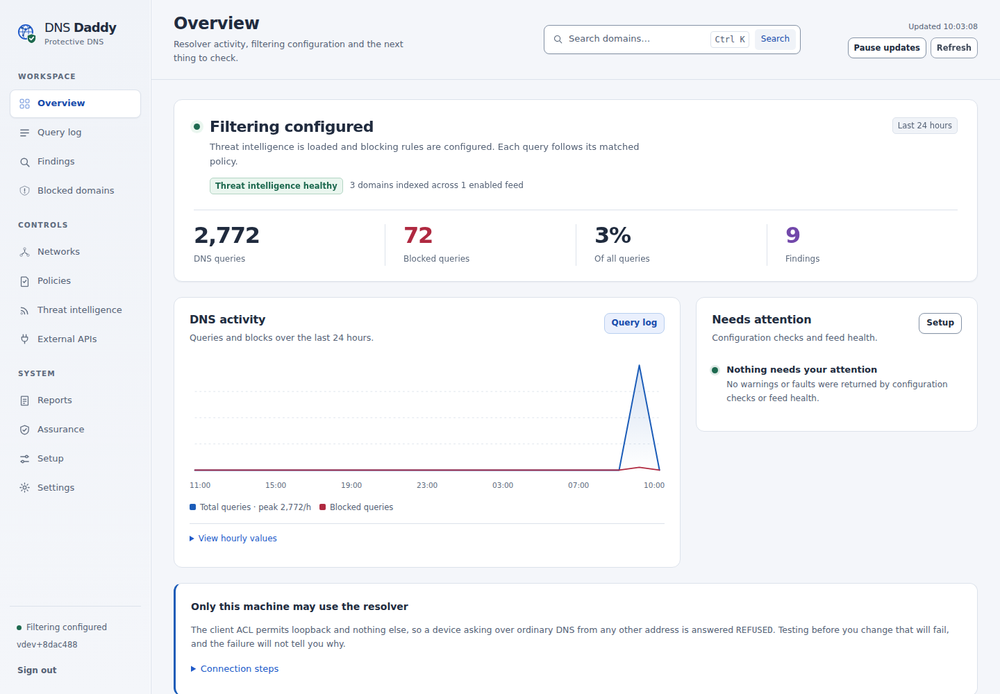
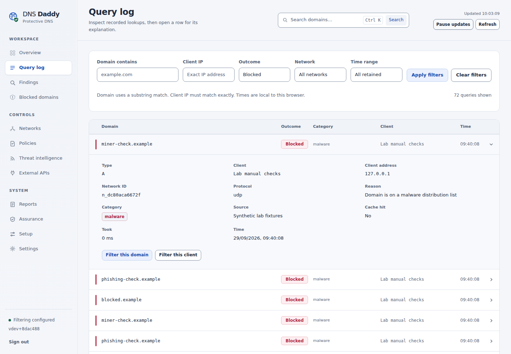
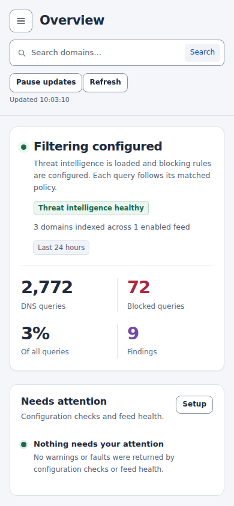

# Neo Aqua workspace

Implemented UI direction, 29 September 2026. Reviewed against main at
`8dac4886661fdd5e303bea8010ebded4e0b978ea`.

## Product purpose

DNS Daddy should help an operator answer four questions: what happened, which
client and policy were involved, why the resolver made its decision, and what
to investigate next. This change makes existing capabilities easier to use
within the embedded HTML, CSS and JavaScript application.

The visual direction is light first: silver-grey surfaces, white working areas,
restrained blue emphasis and subtle depth on controls. It retains the existing
globe/shield mark as a recoloured SVG. System fonts and local assets keep the
single-binary deployment and existing content-security policy intact.

## Navigation

| Group | Pages | Purpose |
|---|---|---|
| Workspace | Overview, Query log, Findings, Blocked domains | Understand activity and follow evidence. |
| Controls | Networks, Policies, Threat intelligence, External APIs | Configure who may use the resolver and how queries are evaluated. |
| System | Reports, Assurance, Setup, Settings | Operate, inspect and maintain the installation. |

Existing route identifiers remain stable. For example, Overview still uses
`#/dashboard` and Findings uses `#/detections`. Sign out sits in the navigation
footer. The active page has `aria-current="page"`.

The sidebar is compact on desktop. At 760px and below it becomes a dismissible
drawer with explicit open/close controls, Escape handling, focus restoration and
an inert background. Closed navigation is hidden from keyboard interaction.

## Overview

The first section contains a scoped configuration headline and a single row of
four measurements. DNS activity sits beside Needs attention on wide screens;
attention moves first when the layout stacks. Supporting feed, category,
recent-block and resolver information follows.

Labels describe the measurements the current API actually supplies:

- **Filtering configured** describes the existing server heuristic. It does
  not claim every configured network receives an effective blocking policy.
- **Configured networks**, **Policies** and **Blocked queries** avoid implying
  observed protection, active use or a confirmed malicious query.
- **Feed index empty** does not claim custom rules cannot block traffic.
- **Findings** remain experimental leads, not confirmed incidents.

Optional API failures leave the rest of the page available. Failed panels say
what could not be retrieved, offer Retry and contribute an explicit attention
item. A failed sidebar status request changes to **Status unavailable**.

Common operational facts and next steps remain visible. Diagnostic evidence and
connection instructions use labelled native disclosures. The first-client
message keeps the measured client/access state visible when its steps are
collapsed. The activity chart has an accompanying disclosure containing exact
hourly values in an HTML table.

## Query log and investigation entry points

The query log exposes five labelled filters: domain substring, exact client IP,
outcome, network and retained-data time range. The server supports relative
`hours`; the options are All retained, Last hour, Last 24 hours and Last 7 days.
Unsupported `since`/`until` parameters are not sent.

Filters live in the hash URL, for example:

```text
#/queries?domain=example.com&clientIp=192.0.2.10&action=blocked&hours=24
```

Bookmarks, browser history and Refresh preserve this context. Clear filters
returns to the unfiltered log. Removed/unavailable network names do not silently
drop the requested network filter.

Desktop records use aligned columns for domain, outcome, category, client and
time. At narrower widths the same content reflows into compact records. Each
record is a native `details` element; its explanation retains reason, source,
network/policy facts and available DNSSEC observations. Client and time labels
also appear in screen-reader text. Unknown outcomes are shown as Unknown.

Domain and client actions open real query filters while retaining the other
active filters. Cache hit is shown only when the record includes a Boolean
value; a missing hit does not imply that an upstream resolver answered. The header search currently
searches domains in the query log; it is not a global device or threat-intelligence
index. Ctrl+K or Meta+K focuses it when focus is outside an editable field.

Loading, unfiltered emptiness, no matching results and request failure have
different wording. Pagination failures preserve loaded rows and allow retry.
An in-flight request cannot overwrite a newer route/filter, and repeated
pagination clicks cannot append the same page twice.

## Interaction and accessibility

The implementation uses native links, buttons, forms, labels and disclosures.
It includes a skip link, visible focus, text beside semantic status colours,
reduced-motion styles and forced-colour focus treatment. Primary form controls
are approximately 40px high; compact controls retain a minimum usable target.

Overview and Blocked domains retain the existing periodic update capability,
with a visible Pause/Resume control. Automatic updates yield while a user is
editing, reading an open disclosure, waiting for a request or viewing another
tab. Manual Refresh remains available. Authentication loss invalidates pending
page work before showing the login screen.

The main palette is centralised in existing CSS custom properties:

| Role | Value |
|---|---|
| Page | `#F4F6FA` |
| Working surface | `#FFFFFF` |
| Secondary surface | `#F0F3F8` |
| Primary text | `#202B3E` |
| Secondary text | `#546175` |
| Primary action | `#205AC9` |
| Brand/focus blue | `#1B5CB8` |
| Success text | `#1D694F` |
| Warning text | `#8C4B0E` |
| Block/error text | `#AF2940` |

The JavaScript test suite checks the text palette against the main surfaces.
This work has targeted accessibility checks; it does not constitute a complete
WCAG conformance assessment or a screen-reader compatibility audit.

## Research informing these decisions

| Source | Applied decision |
|---|---|
| [Nielsen Norman Group: usability heuristics](https://www.nngroup.com/articles/ten-usability-heuristics/) | Visible status, familiar labels, consistent navigation and recoverable failures. |
| [Nielsen Norman Group: progressive disclosure](https://www.nngroup.com/articles/progressive-disclosure/) | Keep common facts visible and expose detailed evidence on demand. |
| [Carbon: data tables](https://carbondesignsystem.com/components/data-table/usage/) | A visible filter/search toolbar, comparable rows and predictable detail actions. |
| [Carbon: empty states](https://carbondesignsystem.com/patterns/empty-states-pattern/) | Distinguish empty data, filtered results and failures with useful next steps. |
| [WCAG 2.2](https://www.w3.org/TR/WCAG22/) | Text contrast, visible focus, keyboard operation, status wording and responsive reflow. |
| [W3C: minimum target size](https://www.w3.org/WAI/WCAG22/Understanding/target-size-minimum.html) | Maintain usable target sizes and separation for compact controls. |
| [W3C: pause, stop, hide](https://www.w3.org/WAI/WCAG22/Understanding/pause-stop-hide.html) | Give operators control of automatic updates and preserve active reading context. |

These sources inform design choices; they do not establish that a particular
layout has been validated with DNS Daddy users. Observed usability sessions with
IT generalists remain a useful next step.

## Actual application previews

All data below comes from a local synthetic DNS lab. The loopback-only access
notice is accurate for that lab. These images do not show a production network.

### Overview



### Query explanation



### Phone layout



## Validation record

- `make test-ui`: **218 passing tests**, including existing security/claims
  coverage and new route, filtering, request-ownership, retry, refresh and
  accessibility regressions.
- `git diff --check`: clean.
- All twelve pages rendered in Chromium. Initial 1440px desktop and 390px phone
  checks found no page overflow or JavaScript exceptions. Disabled external-API
  fixture endpoints returned their expected 503 responses and were displayed as
  unavailable; they were not reported as healthy data.
- Real-browser interaction checks passed for search, filter apply/refresh/clear,
  pause/resume, Ctrl+K and Meta+K, mobile focus isolation and Escape restoration,
  and keyboard-operated native query details. These flows made no external
  resource requests and produced no JavaScript or HTTP errors.
- Final rebuilt-binary smoke checks passed directly against the embedded assets
  with the production CSP. Served JavaScript, CSS and HTML hashes matched the
  checkout. All eight interaction groups passed, including retained row-filter
  context, factual cache details and visible/focusable search at 768px. No
  JavaScript exceptions, console/CSP errors, failed resources or external
  resource requests occurred in these checks.
- Query rows and header groups stayed within their bounds at 320px, 768px and
  1024px. A separate check using the actual metric renderer with six-digit
  synthetic counts passed at 320px, 768px, 820px and 1024px. The final screenshots
  above were taken from the rebuilt application's embedded UI.

Baseline Go validation used Go 1.25.13: `make lint` passed, and the race run passed
31 package groups without race warnings. The complete command failed because
nine deployment tests could not change UID in this environment
(`setpriv: setresuid failed: Invalid argument`). No Go source or deployment
behaviour is changed by this UI work; those deployment tests still require a
suitable environment before release.

## Backend work intentionally specified for the next increment

The accompanying Claude Code brief prioritises a confirmed multi-CIDR policy
selection defect, factual overview metrics, consistent observation windows and
complete finding pagination. It then specifies joined domain/client
investigations, read-only current-policy preview, finding review metadata and
Daddybound runtime visibility.

Those features do not exist merely because the UI has room for them. This change
does not add finding acknowledgement, global investigation, live DNSSEC
enforcement, SafeSearch enforcement or a security score. It preserves the current
API, authentication and resolver behaviour. Learn remains observational and Live
unavailable. Native Learn's auxiliary authoritative DNS uses a separate
plaintext transport from any encrypted forwarding upstream.

Extend this visual system when those real contracts arrive. Preserve historical
decision evidence, explicit experimental status, local-data defaults and the
distinction between unavailable data and an empty successful response.
